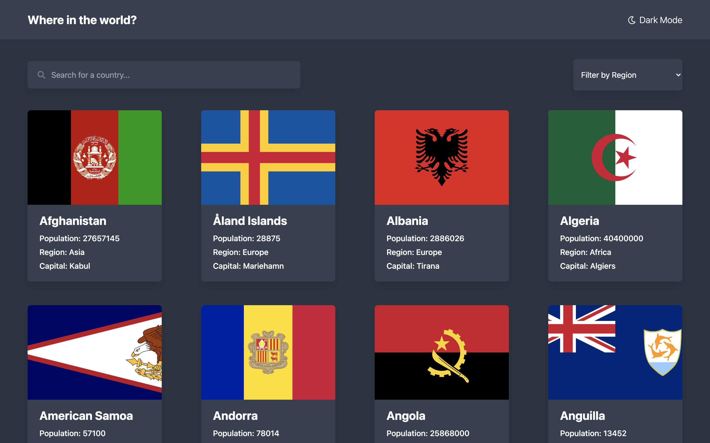
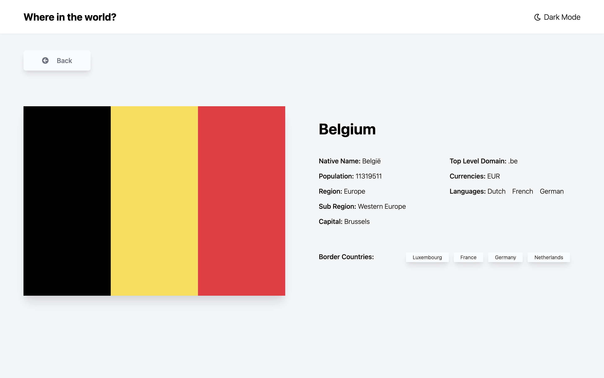

# National-List

This is a web-app created by Marshall

This web can lets user browse all the countery detail information around the world!


## Technologies Used
- Generating using [Vue3] (https://v3.vuejs.org/)
- Using [Tailwindcss] for styling (https://tailwindcss.com/)
- [JavaScript] (https://developer.mozilla.org/en-US/docs/Web/JavaScript)
- [Firebase] for deployment (https://firebase.google.com/)

## API Used
- REST COUNTRIES (https://restcountries.eu/)

## Features
As a User:
- I can browse/search/filter all countries in homepage, and check details in Detail page, also can check the border country.(Darkmode and responsive supported)

## Screenshot
Home:

Details:


## Setup
Online Visit(https://nations-list.firebaseapp.com/)

For Localhost

```
npm install
```

### Compiles and hot-reloads for development
```
npm run serve
```

## Structure

Virtual Dom Structure

Main entrance: ```src/App.vue```
               ```src/main.js```

Views are in the ```src/views ```
  - Home:  ```Home.vue```
  - Details: ```Details.vue```

Components in the ```src/components```
  - Card: ```Card.vue```
  - Header: ```Header.vue```
  - Nationcard: ```Nationcard.vue```
  - Nationslist:  ```Nationslist.vue```
  - Spinner:  ```Spinner.vue```
  - Toolsbar:  ```Toolsbar.vue```

  Reusable JS code in the ```src/composables```
  
  router is in the ```src/router```
